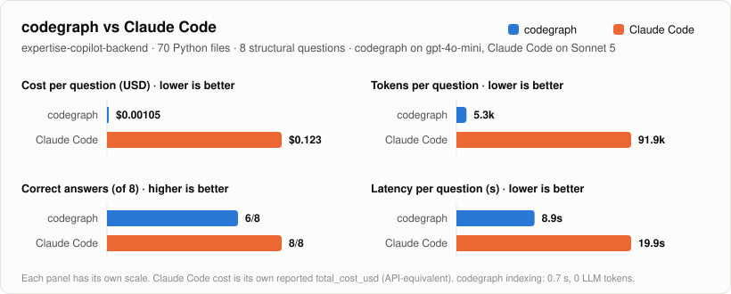

# codegraph

Ask questions about a Python codebase in plain language, typed or spoken, and get answers from a **code graph** instead of an LLM reading your files.

codegraph parses a repo with Python's `ast` (never running it) into a Neo4j graph of files, modules, classes and functions, linked by `CONTAINS`, `IMPORTS` and `INHERITS` edges that record where they come from. In the web UI you connect a local folder or a public Git URL, index it, and ask things like *"which classes inherit from BaseDTO?"*. An LLM turns the question into a read-only Cypher query, and the answer comes from the returned rows, with `path:line` citations.

## codegraph vs Claude Code

The same 8 structural questions (subclasses, importers, methods, dependencies, tests) about a 70-file backend, with ground truth computed from the code:

<picture>
  <source media="(prefers-color-scheme: dark)" srcset="docs/codegraph-vs-claude-code-dark.svg">
  
</picture>

| Per question | codegraph (gpt-4o-mini) | Claude Code (Sonnet 5) |
|---|---|---|
| Cost | **$0.001** | $0.123 |
| Tokens | **5.3k** | 91.9k |
| Correct | 6/8 (97% of items) | **8/8** |
| Latency | **8.9 s** | 19.9 s |

- **About 116× cheaper and twice as fast.** codegraph sends a small fixed prompt and one query. Claude Code resends its context on every turn and reads source files to find the answer. Indexing takes under a second and uses no LLM.
- **Claude Code was more accurate.** codegraph's two misses were in writing the answer: the query had returned every item, but the model left some out of a long list.
- **Different models:** the two runs used different models (gpt-4o-mini vs Sonnet 5), so part of the cost gap comes from the model itself.
- **Structural questions only.** codegraph can't yet answer questions that need code text, such as environment variable names or what a function does.

## Prerequisites

- [Podman](https://podman.io/) 5.x with `podman compose` (on Windows/macOS, a running `podman machine`)
- An OpenAI or [OpenRouter](https://openrouter.ai/) API key
- Optional, to run on the host: [uv](https://docs.astral.sh/uv/) and `git`

## Setup

```bash
cp .env.example .env
```

In `.env`, set:

- `NEO4J_PASSWORD` (at least 8 characters)
- `REPO_PATH`: a parent folder of your projects, e.g. `D:/Projects`
- the LLM: `LLM_PROVIDER=openai` with `OPENAI_API_KEY`, or `LLM_PROVIDER=openrouter` with `OPENROUTER_API_KEY` and `LLM_MODEL=openai/gpt-4o-mini`

```bash
podman compose up -d
```

Open **http://localhost:8501**. The Neo4j browser is on http://localhost:7474 (user `neo4j`).

Notes:
- **Password changes:** `NEO4J_AUTH` only applies when the data volume is created, so to change the password later, also change it in Neo4j (`ALTER CURRENT USER SET PASSWORD ...`) and then run `podman compose up -d`.
- **Windows:** `REPO_PATH` accepts `D:/...`, `D:\...` or `/mnt/d/...`. In Git Bash, prefix container commands with `MSYS_NO_PATHCONV=1`.

## Usage

- **UI:**
  1. **Connect repository:** pick a folder under `/repos`, or paste a public `https://` Git URL.
  2. Click **Index**.
  3. Ask a question in the chat box, or click the mic (local Whisper; audio never leaves your machine).

  Each answer shows the Cypher, which you can edit and re-run. Queries are read-only (Neo4j checks them with `EXPLAIN`, and they run in READ mode), with a row cap and a timeout.
- **CLI:**
  - `podman compose exec app codegraph index /repos/my-repo`
  - or on the host: `uv run codegraph index path/to/repo`
  - `uv run codegraph ui` runs the UI without containers.
- **Tests:** `uv run pytest`. Opt-in suites: `-m network`, `-m whisper`, `-m llm`.
- **Privacy:** questions, the schema description and result rows (names, paths, signatures) go to your LLM provider. Source code and audio do not.
- **Roadmap and design:** [SPEC.md](SPEC.md) (call graph, git history, a tool-using agent, the benchmark) and [openspec/](openspec/).
